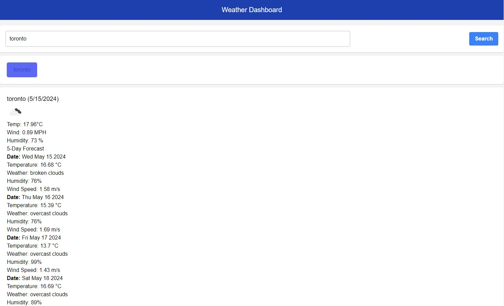

# The-Weather-Board

## Description 
The Weather Dashboard is a web application that provides users with current and future weather information for multiple cities. It retrieves weather data from the OpenWeatherMap 5 Day Weather Forecast API and displays dynamically updated HTML and CSS content. Users can search for a city to view its weather conditions, which are then saved in the search history for easy access. 

### Usage 
1. Open the Weather Dashboard in your browser.

2. Enter the name of a city in the search form and submit.

3. View the current weather conditions and 5-day forecast for the city.

4. Click on a city in the search history to view its weather information again.

### Features

**Search for a City:** Enter a city name to retrieve its current and future weather conditions.

**Current Weather:** Displays city name, date, weather icon, temperature, humidity, and wind speed.

**5-Day Forecast:** Shows the date, weather icon, temperature, humidity, and wind speed for the next five days

### Links
[GitHub](https://github.com/a293moha/The-Weather-Board)

[Deployed Application](https://a293moha.github.io/The-Weather-Board/)

### Screenshot
